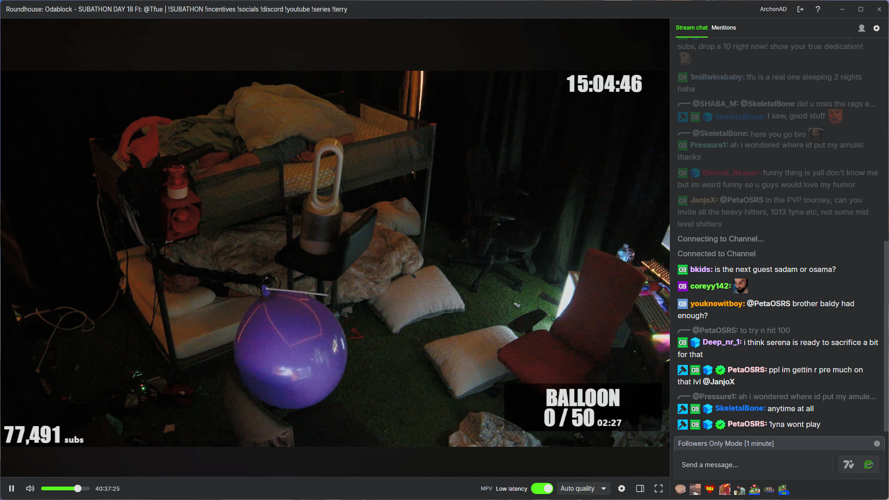
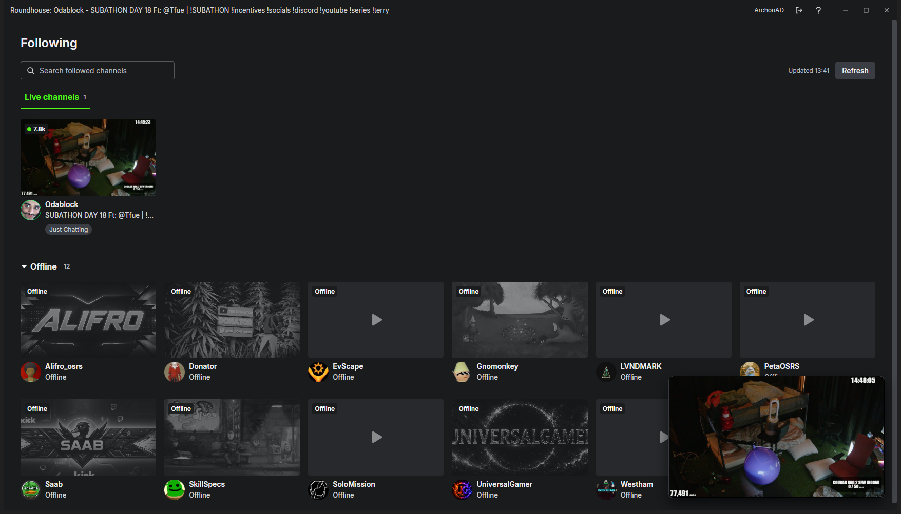

# Roundhouse

A personal Windows stream viewer built from KickTalk: your followed channels, an embedded MPV player, and KickTalk chat in one resizable window.

## Screenshots

**Player and chat** — watch a livestream alongside KickTalk's integrated chat.



**Following and mini player** — browse live and offline followed channels while the stream continues in the corner.



The stream shown in both screenshots is from **Odablock's livestream during his September 2026 subathon**. Stream content belongs to Odablock and its respective rights holders; screenshots illustrate Roundhouse and do not imply endorsement. Captured September 19, 2026.

## Setup and run

**Windows 10/11 x64.** Install these prerequisites, then reopen PowerShell:

- [Git for Windows](https://git-scm.com/download/win).
- [Node.js 24 x64](https://nodejs.org/en/download), including npm.
- [Python 3.10+](https://www.python.org/downloads/windows/) on `PATH` (3.13 tested).
- [Visual Studio 2022 Build Tools](https://visualstudio.microsoft.com/downloads/#build-tools-for-visual-studio-2022) or Community, with **Desktop development with C++**, **MSVC v143**, and a **Windows 10/11 SDK**.

```powershell
git clone https://github.com/esbe1175/roundhouse.git Roundhouse
Set-Location Roundhouse
npm run setup -- --run
```

Setup installs dependencies, downloads and verifies MPV, builds the native host and app, and launches Roundhouse. Allow several minutes and several GB of disk space; the first setup needs internet access. Omit `--run` to build only.

Choose **Sign in to Kick** inside the app. No `.env`, API credentials, separate MPV installation, or additional chat login is needed. Login cookies stay in the local Electron profile; never commit credentials or runtime profiles.

## Build

For a fresh clone, including the Windows installer:

```powershell
npm run setup -- --installer
```

After setup, rebuild the full distribution with:

```powershell
npm run build:win
```

- **Installer:** `dist/Roundhouse-0.1.0-setup.exe`.
- **Unpacked app:** `dist/win-unpacked/Roundhouse.exe`. Copy the **whole `win-unpacked` folder** when moving it.
- Close Roundhouse before rebuilding. Builds do not publish releases; the inherited upstream updater is disabled.

For development, run `npm run dev`. `npm run build` compiles JS/CSS only; `npm run build:unpack` produces the unpacked distribution. Rerun `npm run setup` after dependency changes to rebuild from the lockfile.

If PowerShell blocks `npm.ps1`, use `npm.cmd` instead. Compiler errors usually mean the C++ workload/SDK is missing; locked output files usually mean Roundhouse or a test MPV process is still running. Kick may require you to sign in again when a session expires.

## License and acknowledgements


Roundhouse is distributed under the **GNU General Public License, version 3**, inherited from KickTalk. [LICENSE](LICENSE) preserves the upstream license text unchanged. Third-party components retain their own licenses; [THIRD_PARTY_NOTICES.md](THIRD_PARTY_NOTICES.md) records attribution, versions, source links and license locations.

Thank you to:

- **Dark, ftk789 and the KickTalk contributors** for the application, design language and full chat experience.
- **The mpv/MPlayer/mplayer2 contributors and shinchiro** for the player and Windows distribution, and **FFmpeg/libplacebo contributors** for media and rendering work.
- **Streamlink contributors** for documenting Kick/IVS prefetch behavior in their open-source player integration.
- **Electron, Chromium, React, Lexical, Radix/WorkOS**, and the maintainers of our other npm dependencies for the application platform and controls.
- **The Inter Project Authors and Phosphor Icons** for typography and icons inherited through KickTalk.
- **Kick and 7TV** for the platform, community emotes and cosmetics. Roundhouse is an independent project and is not endorsed by these services.

Builds include readable notices under `resources/licenses/`, plus Electron's `LICENSE.electron.txt` and `LICENSES.chromium.html` beside the executable. The MPV notices describe the scope of the supplied upstream license texts and the additional corresponding-source/notices work needed when distributing third-party binary releases.

<details>
<summary>Implementation context for agents and maintainers</summary>

### Architecture and boundaries

- Electron main owns the persistent `roundhouse-kick` session, authenticated Kick requests, follows, stream resolution, and MPV lifecycle. The sandboxed preload exposes named, validated IPC operations; remote login pages receive no application preload or token/cookie accessors.
- Preserve KickTalk's React/Zustand/SCSS chat stack, themes, emotes, replies, mentions, settings, and moderation tools. A C++ Node-API module owns the child HWND used by MPV; commands and events travel over a per-process named pipe. Chromium-only screenshots omit the native video; direct window capture includes it.
- Website-session authentication does not use the legacy `roundhouse_client_id`, `roundhouse_client_secret`, or `roundhouse_redirect_url` variables and does not start an OAuth callback listener. Never copy cookies into JSON or `.env`.
- Follows use `/api/v2/channels/followed-page` (`channel_slug`, `is_live`, optional `nextCursor`); live metadata uses `/api/v2/channels/{slug}/info`. These website endpoints are undocumented. Keep malformed responses, expired sessions, browser challenges, rate limits, and network errors distinct. Failed refreshes retain the previous list.

### Playback and UI invariants

- The account session resolves HTTPS HLS media; account cookies never go to media hosts. Quality options come from the master playlist. Optional low latency streams IVS `EXT-X-PREFETCH` bytes through a private single-client loopback transport, with ordinary HLS fallback. Auto selects the highest advertised variant; resuming low-latency playback returns to live.
- Recovery checks Kick's live status and resolves fresh media after 1, 3, and 8 seconds. A second low-latency recovery uses HLS for that viewing session; Live/Retry retries the preferred transport. Reset the budget after 30 seconds of stable playback. Preserve chat and playback preferences; cancel retries on Back, logout, or stream switches. MPV EOF alone does not establish that a channel is offline.
- Diagnostics: `%APPDATA%/Roundhouse/logs/playback.log`, with one rotated `.1` file, approximately 256 KiB each. Exclude media URLs, credentials, account data, and chat content. Custom profiles keep their own logs.
- Player controls overlay the full-height video; menus cut out native video regions without resizing it. Cinema retains chat; fullscreen hides it. Keyboard shortcuts must not intercept typing in the chat editor.
- Chat follows the bottom through retention, filtering, late emote sizing, and resizing, but preserves the reading position after manual scroll-up. Pins/system notices stay visible; replacements preserve original text for replies/moderation. Text rules and previews run in a worker with a 500 ms limit; a timeout pauses the rule for the view without deleting saved rules. Keep popups inside usable display/chat bounds, with close/Escape and retry/fallback behavior.
- Glow defaults live in [utils/glow-settings.mjs](utils/glow-settings.mjs): enabled, 15% intensity, 50% falloff. MPV samples a 6×4 palette every three seconds; Chromium blends blurred fields over 2.6 seconds. Stop sampling when paused, hidden, minimized, disabled, at zero intensity, or without black bars. A fixed 128×128 dither tile adds/subtracts at most one 8-bit level and scales to physical pixels.

### Assets, builds, and checks

- [resources/mpv-manifest.json](resources/mpv-manifest.json) pins the MPV distribution, SHA-256, source revision, and provenance. Verify before extraction; reuse only validated archives. Updating MPV requires corresponding manifest/license updates and native/desktop checks. The build downloads prebuilt MPV; it does not compile MPV/FFmpeg.
- [scripts/generate-icons.py](scripts/generate-icons.py) uses Pillow and the original 8×9 [Roundhouse.bmp](Roundhouse.bmp). Black becomes `#53FC18`, white becomes transparent. The 256×256 master contains exact 24×24 source-pixel blocks at (32, 20); derive smaller PNG/ICO sizes directly with Lanczos, without per-size adjustments.
- `npm run setup:mpv`, `npm run build:native`, and `npm run notices` rebuild individual prerequisites. `npm run verify:package` checks packaged resources, notices, and secret exclusion.

```powershell
npm run lint
npm test
npm run build
npm run test:desktop
npm run test:player
npm run build:native
npm run test:native
npm run build:win
npm run verify:package
```

Desktop/native tests use isolated fixture profiles and real MPV with generated video; they do not validate current live Kick authentication/API behavior. Native checks cover 100% and 150% scaling. Never send real chat messages, vote, or moderate while testing without an explicit user action.

To test a packaged build:

```powershell
$env:ROUNDHOUSE_TEST_EXE = (Resolve-Path 'dist/win-unpacked/Roundhouse.exe').Path
npm run test:desktop
Remove-Item Env:ROUNDHOUSE_TEST_EXE
```

[Windows CI](.github/workflows/build.yml) runs bootstrap, lint, unit tests, and package verification without publishing. Interactive tests run locally. Use `npm ci` and the committed lockfile. Native modules must target the locked Electron ABI, not system Node. If Python detection fails, use `py --list-paths` and set `$env:npm_config_python`. For a checksum mismatch, remove only the named cached MPV archive and retry; never change the expected hash to accept an unexpected download.

### Repository history

Roundhouse is a GitHub fork of KickTalk, preserving history through `a3570be165618f70449257bbb70df7cd16b66efe`. Roundhouse development is on `main` at `esbe1175/roundhouse`; the development checkout uses `origin` for Roundhouse and `upstream` for KickTalk. Review upstream changes before merging. Keep credentials, downloaded binaries, builds, profiles, logs, and caches out of Git. `private: true` in `package.json` prevents npm publication, not public Git hosting.

</details>
